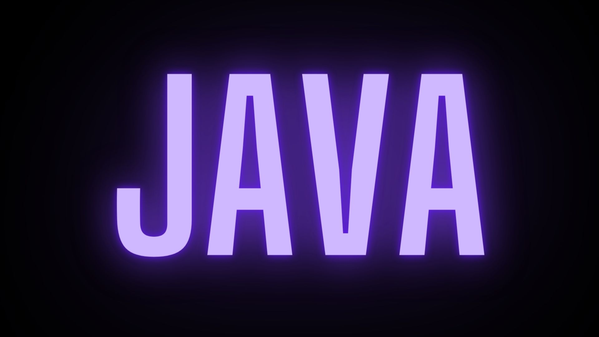
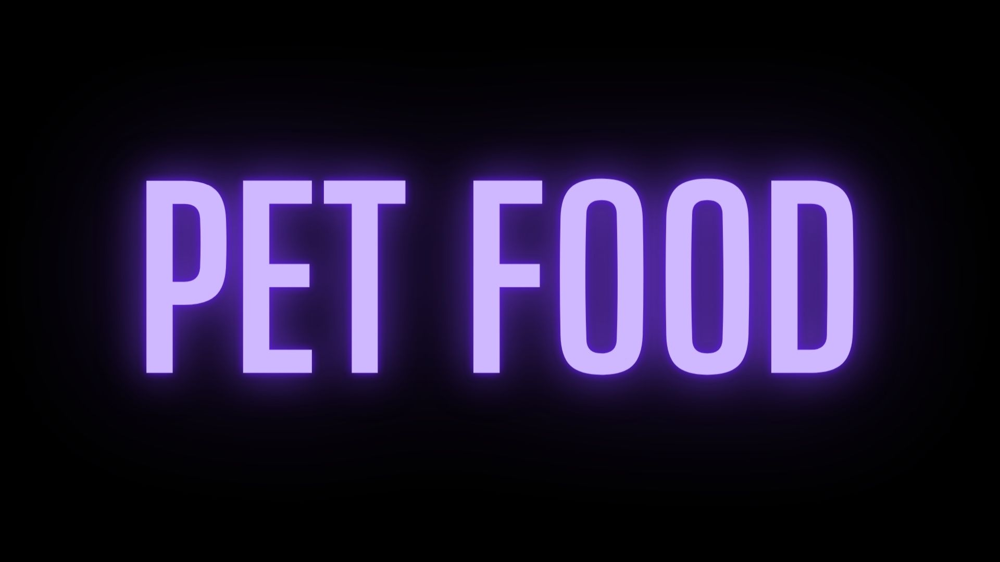
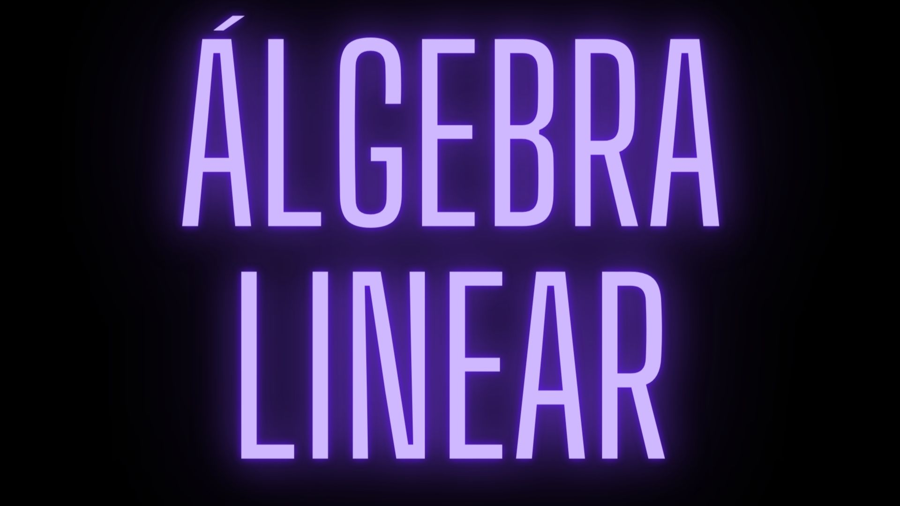

## Oi! Meu nome é Lais Sales

### Sejam muito bem vindes ao meu perfil!

- 📏 Sou professora particular de exatas
- 🖥️ Estou fazendo o bootcamp de Desenvolvedorxs Java na Generation
- 🔭 Tenho interesse em back-end
- 😊 Meus pronomes são ela/dela

	<a href="https://github.com/laiszz">
	
	

	
### Linguagens de Interesse

 
	
	
	
	
	
	
	

### Repositórios da Generation

 
	<a href="https://github.com/laiszz/java">
	
	<a href="https://github.com/laiszz/mySQL">
	
	<a href="https://github.com/projetoPetFood/petfood">
	
	<a href="https://github.com/laiszz/blog_pessoal">
	

	
### Repositórios de Projetos Pessoais

	
	

	
### Contatos

 
	 
 	
 	 

